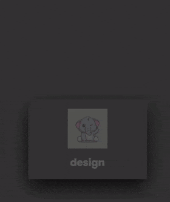

## card design

### type01

#### Languages

- HTML : [type01 - HTML](./type01/index.html)
- CSS  : [type01 - CSS](./type01/style.css)

 

### type02

#### Languages

- HTML : [type02 - HTML](./type02/index.html)
- CSS  : [type02 - CSS](./type02/style.css)

 

### type03

#### Languages

- HTML & JavaScript : [type03 - HTML](./type03/index.html)
- CSS  : [type03 - CSS](./type03/style.css)

 